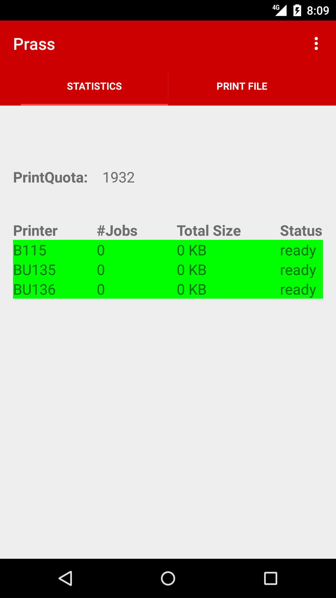
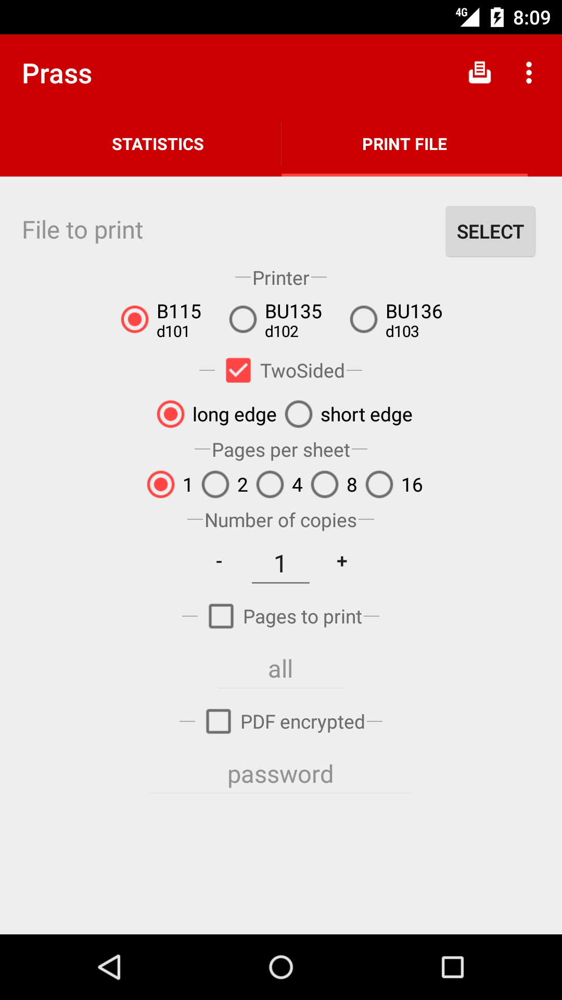

Prass
=======
Prass is an Android app designed to print via an SSH connection.

It was developed for using printers at the CIP pools at the math department of LMU Munich, where it should work out of the box. However, it can easily be configured to work for any setup where you have SSH access to a server that can print via the Unix `lp` command.

 

Some Details
------------
When a file is sent for printing, it's copied (via `scp`) to the server, where the `lp` command is executed via `ssh` to create a print job. The copy of the file is deleted afterwards.

The app supports password-protected PDFs and choosing some standard printer job options (two-sided printing, multiple pages per sheet, printing multiple copies, giving a list of pages to be printed, ...) in a neat GUI.

In the app's settings, you can configure the server hostname(s) and provide a list of available printers, so it should be easy to adapt the app to your needs.

Download
--------
Once you've cloned this repository, the app can be compiled from Android Studio, or by running

    ./gradlew assemble

in the root of the repository from a command line, provided you have the necessary Android frameworks installed (this can fail if you're using JDK 13; try running it with JDK 8).
